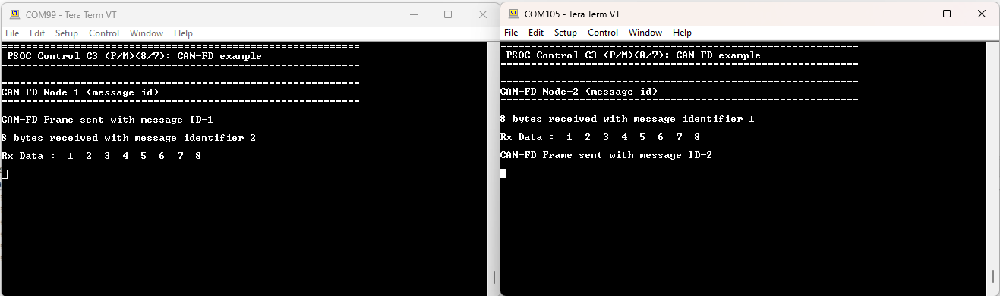

# PSOC&trade; Control C3M/P8: CAN FD

Controller Area Network Flexible Data‑Rate (CAN FD) is a communication protocol typically used for broadcasting sensor data and control information over 2‑wire interconnections between nodes. This example demonstrates how to use CAN FD in Infineon’s PSOC&trade; Control C3M/P8 MCU.

In this example, CAN FD Node‑1 sends a CAN FD frame to CAN FD Node‑2 when the user button is pressed, and vice versa. Both CAN FD nodes log the received data over the UART terminal. Each time a CAN FD frame is received, the user LED toggles.

[View this README on GitHub.](https://github.com/Infineon/mtb-example-ce241647-canfd)

[Provide feedback on this code example.](https://yourvoice.infineon.com/jfe/form/SV_1NTns53sK2yiljn?Q_EED=eyJVbmlxdWUgRG9jIElkIjoiQ0UyNDE2NDciLCJTcGVjIE51bWJlciI6IjAwMi00MTY0NyIsIkRvYyBUaXRsZSI6IlBTT0MmdHJhZGU7IENvbnRyb2wgQzNNL1A4OiBDQU4gRkQiLCJyaWQiOiJjaGlyYWdzYW1wYXQuamhhd2FyQGluZmluZW9uLmNvbSIsIkRvYyB2ZXJzaW9uIjoiMS4wLjAiLCJEb2MgTGFuZ3VhZ2UiOiJFbmdsaXNoIiwiRG9jIERpdmlzaW9uIjoiTUNEIiwiRG9jIEJVIjoiSUNXIiwiRG9jIEZhbWlseSI6IlBTT0MifQ==)

## Requirements

- [ModusToolbox&trade;](https://www.infineon.com/modustoolbox) v3.9.0 or later (tested with v3.9.0)
- Board support package (BSP) minimum required version for:
   - KIT_PSC3M8_EVK: v2.2.0
   - KIT_PSC3M8_CC1: v2.2.0
- Programming language: C
- Associated parts: All [PSOC&trade; Control C3M/P8 MCU](https://www.infineon.com/products/microcontroller/32-bit-psoc-arm-cortex/32-bit-psoc-control-arm-cortex-m33-mcu/psoc-control-c3-performance-line) parts


## Supported toolchains (make variable 'TOOLCHAIN')

- GNU Arm&reg; Embedded Compiler v14.2.1 (`GCC_ARM`) – Default value of `TOOLCHAIN`
- Arm&reg; Compiler v6.22 (`ARM`)
- IAR C/C++ Compiler v9.70.4 (`IAR`)


## Supported kits (make variable 'TARGET')

- [PSOC&trade; Control C3M8 Evaluation Kit](https://www.infineon.com/KIT_PSC3M8_EVK) (`KIT_PSC3M8_EVK`) – Default value of `TARGET`
- [PSOC&trade; Control C3M8 Control Card Kit](https://www.infineon.com/KIT_PSC3M8_CC1) (`KIT_PSC3M8_CC1`)


## Hardware setup

This example uses the board's default configuration. See the kit user guide and schematic to ensure that the board is configured correctly.

This code example requires minimum two kits listed in the
[Supported kits](#supported-kits-make-variable-target) section. The first kit runs this example as is; the second kit should be programmed with the `USE_CANFD_NODE` macro as "CANFD_NODE_2" in the *main.c* file.

Use jumper wires to establish a connection between CAN FD-NODE-1 and CAN FD-NODE-2.

   Function in CAN node | KIT_PSC3M8_CC1 | KIT_PSC3M8_EVK
   ---------| ---------------------- | -------------------
   CAN2_L   | J3[2]                  |  J14[1]
   CAN2_H   | J3[3]                  |  J14[2]


## Software setup

See the [ModusToolbox&trade; tools package installation guide](https://www.infineon.com/ModusToolboxInstallguide) for information about installing and configuring the tools package.

Install a terminal emulator if you do not have one. Instructions in this document use [Tera Term](https://teratermproject.github.io/index-en.html).

This example requires no additional software or tools.


## Using the code example


### Create the project

Create the project and open it using one of the following:

The ModusToolbox&trade; tools package provides the Project Creator as both a GUI tool and a command line tool.

<details><summary><b>Use Project Creator GUI</b></summary>

1. Click the **New Application** link in the **Quick Panel** (or, use **File** > **New** > **ModusToolbox&trade; Application**). This launches the [Project Creator](https://www.infineon.com/ModusToolboxProjectCreator) tool

2. Pick a kit supported by the code example from the list shown in the **Project Creator - Choose Board Support Package (BSP)** dialog

   When you select a supported kit, the example is reconfigured automatically to work with the kit. To work with a different supported kit later, use the [Library Manager](https://www.infineon.com/ModusToolboxLibraryManager) to choose the BSP for the supported kit. You can use the Library Manager to select or update the BSP and firmware libraries used in this application. To access the Library Manager, click the link from the **Quick Panel**.

   You can also just start the application creation process again and select a different kit.

   If you want to use the application for a kit not listed here, you may need to update the source files. If the kit does not have the required resources, the application may not work.

3. In the **Project Creator - Select Application** dialog, choose the example by enabling the checkbox

4. (Optional) Change the suggested **New Application Name**

5. The **Application(s) Root Path** defaults to the Eclipse workspace which is usually the desired location for the application. If you want to store the application in a different location, you can change the *Application(s) Root Path* value. Applications that share libraries should be in the same root path

6. Click **Create** to complete the application creation process

For more details, see the [Eclipse IDE for ModusToolbox&trade; user guide](https://www.infineon.com/MTBEclipseIDEUserGuide) (locally available at *{ModusToolbox&trade; install directory}/docs_{version}/mt_ide_user_guide.pdf*)

</details>

<details><summary><b>In command-line interface (CLI)</b></summary>

ModusToolbox&trade; provides the Project Creator as both a GUI tool and the command line tool, 'project-creator-cli'. The CLI tool can be used to create applications from a CLI terminal or from within batch files or shell scripts. This tool is available in the *{ModusToolbox&trade; install directory}/tools_{version}/project-creator/* directory.

Use a CLI terminal to invoke the 'project-creator-cli' tool. On Windows, use the command-line 'modus-shell' program provided in the ModusToolbox&trade; installation instead of a standard Windows command-line application. This shell provides access to all ModusToolbox&trade; tools. You can access it by typing "modus-shell" in the search box in the Windows menu. In Linux and macOS, you can use any terminal application.

The following example clones the "[mtb-example-ce241647-canfd](https://github.com/Infineon/mtb-example-ce241647-canfd)" application with the desired name "MyCANFD" configured for the *KIT_PSC3M8_EVK* BSP into the specified working directory, *C:/mtb_projects*:

   ```
   project-creator-cli --board-id KIT_PSC3M8_EVK --app-id mtb-example-ce241647-canfd --user-app-name MyCANFD --target-dir "C:/mtb_projects"
   ```

Argument | Description | Required/optional
---------|-------------|-----------
`--board-id` | Defined in the <id> field of the [BSP](https://github.com/Infineon?q=bsp-manifest&type=&language=&sort=) manifest | Required
`--app-id`   | Defined in the <id> field of the [CE](https://github.com/Infineon?q=ce-manifest&type=&language=&sort=) manifest | Required
`--target-dir`| Specify the directory in which the application is to be created if you prefer not to use the default current working directory | Optional
`--user-app-name`| Specify the name of the application if you prefer to have a name other than the example's default name | Optional

<br>

> **Note:** The project-creator-cli tool uses the `git clone` and `make getlibs` commands to fetch the repository and import the required libraries. For details, see the "Project creator tools" section of the [ModusToolbox&trade; tools package user guide](https://www.infineon.com/ModusToolboxUserGuide) (locally available at {ModusToolbox&trade; install directory}/docs_{version}/mtb_user_guide.pdf).

</details>


### Open the project

After the project has been created, you can open it in your preferred development environment.


<details><summary><b>Eclipse IDE</b></summary>

Use one of the following options:

- **Use the standalone [Project Creator](https://www.infineon.com/ModusToolboxProjectCreator) tool:**

   1. Launch Project Creator from the Windows Start menu or from *{ModusToolbox&trade; install directory}/tools_{version}/project-creator/project-creator.exe*

   2. In the initial **Choose Board Support Package** screen, select the BSP, and click **Next**

   3. In the **Select Application** screen, select the appropriate IDE from the **Target IDE** drop-down menu

   4. Click **Create** and follow the instructions printed in the bottom pane to import or open the exported project in the respective IDE

<br>

- **Use command-line interface (CLI):**

   1. Follow the instructions from the **In command-line interface (CLI)** section to create the application

   2. Export the application to a supported IDE using the `make <ide>` command

   3. Follow the instructions displayed in the terminal to create or import the application as an IDE project

For a list of supported IDEs and more details, see the "Exporting to IDEs" section of the [ModusToolbox&trade; user guide](https://www.infineon.com/ModusToolboxUserGuide) (locally available at *{ModusToolbox&trade; software install directory}/docs_{version}/mtb_user_guide.pdf*).

</details>


## Operation

1. Connect the CAN and ground pins of the development kit using the instructions in the [Hardware setup](#hardware-setup) section

2. Connect the CANFD-NODE-1 development kit to your PC using the provided USB cable through the KitProg3 USB connector to program the device

3. Program the board using one of the following:

   <details><summary><b>Using Eclipse IDE</b></summary>

      1. Select the application project in the Project Explorer

      2. In the **Quick Panel**, scroll down, and click **\<Application Name> Program (KitProg3_MiniProg4)**
   </details>


   <details><summary><b>In other IDEs</b></summary>

   Follow the instructions in your preferred IDE
   </details>


   <details><summary><b>Using CLI</b></summary>

     From the terminal, execute the `make program` command to build and program the application using the default toolchain to the default target. The default toolchain is specified in the application's Makefile but you can override this value manually:
      ```
      make program TOOLCHAIN=<toolchain>
      ```

      Example:
      ```
      make program TOOLCHAIN=GCC_ARM
      ```
   </details>

4. Connect the CAN FD-NODE-2 kit to your PC using the provided USB cable through the KitProg3 USB connector. Open the *main.c* file and set the `USE_CANFD_NODE` macro to `CANFD_NODE_2`, and follow **Step 3**.

5. Open a terminal program and select the KitProg3 COM port. Set the serial port parameters to 8N1 and 115200 baud.

6. Press **SW3** from NODE-1 for KIT_PSC3M8_EVK, for transmission of frame from NODE-1 to NODE-2 and vice-versa. For KIT_PSC3M8_CC1 connect **P5.2** to ground from NODE-1, for transmission of frame from NODE-1 to NODE-2 and vice-versa.

7. Observe the results in the terminal window. You can see the print-logs from both nodes by opening another instance of the terminal. **Figure 1** shows the print logs from both nodes.

    **Figure 1. Sample output with CAN FD data transmission and reception**

    


## Debugging

You can debug the example to step through the code.


<details><summary><b>In Eclipse IDE</b></summary>

Use the **\<Application Name> Debug (KitProg3_MiniProg4)** configuration in the **Quick Panel**. For details, see the "Program and debug" section in the [Eclipse IDE for ModusToolbox&trade; user guide](https://www.infineon.com/MTBEclipseIDEUserGuide).

</details>


<details><summary><b>In other IDEs</b></summary>

Follow the instructions in your preferred IDE.

</details>


## Design and implementation

Controller Area Network Flexible Data‑Rate (CAN FD) is a data communication protocol used for broadcasting sensor data and control information over 2‑wire interconnections between different parts of an electronic instrumentation and control system. Using CAN FD, Electronic Control Units (ECUs) can dynamically switch between different data rates and vary the length of messages.

In this code example, the CAN FD block is configured with custom configurations because it is not configured to work with default BSP configurations.

This design consists of a CAN FD configuration with nodes and a user button. When the button is pressed on one node, the node sends a CAN frame to the other node, and vice versa. Both CAN FD nodes log the received data over the UART serial terminal. The user LED toggles each time a CAN FD frame is received.


### CAN FD frame format

ID   - CAN FD identifier
DLC  - Data length code
Data - Actual data bytes

ID  | DLC | Data
------|------------|------
0x22 | 0x08 | 0x01 0x02 0x03 0x04 0x05 0x06 0x07 0x08

**Table 1. Application resources**

 Resource  |  Alias/object     |    Purpose
 :-------- | :-------------    | :------------
 CANFD (PDL) |canfd_0_chan_1_HW  | To generate CAN FD frames

<br>


## Related resources

Resources  | Links
-----------|----------------------------------
Code examples  | [Using ModusToolbox&trade;](https://github.com/Infineon/Code-Examples-for-ModusToolbox-Software) on GitHub
Device documentation | [PSOC&trade; Control C3M/P8 MCU documents](https://www.infineon.com/products/microcontroller/32-bit-psoc-arm-cortex/32-bit-psoc-control-arm-cortex-m33-mcu/psoc-control-c3-performance-line?ftab=01#Documents)
Development kits | Select your kits from the [Evaluation board finder](https://www.infineon.com/cms/en/design-support/finder-selection-tools/product-finder/evaluation-board)
Libraries on GitHub  | [mtb-dsl-psc3m8](https://github.com/Infineon/mtb-dsl-psc3m8) – Device Support Library (DSL) <br> [retarget-io](https://github.com/Infineon/retarget-io) – Utility library to retarget STDIO messages to a UART port
Tools  | [ModusToolbox&trade;](https://www.infineon.com/modustoolbox) – ModusToolbox&trade; software is a collection of easy-to-use libraries and tools enabling rapid development with Infineon MCUs for applications ranging from wireless and cloud-connected systems, edge AI/ML, embedded sense and control, to wired USB connectivity using PSOC&trade; Industrial/IoT MCUs, AIROC&trade; Wi-Fi and Bluetooth&reg; connectivity devices, XMC&trade; Industrial MCUs, and EZ-USB&trade;/EZ-PD&trade; wired connectivity controllers. ModusToolbox&trade; incorporates a comprehensive set of BSPs, HAL, libraries, configuration tools, and provides support for industry-standard IDEs to fast-track your embedded application development

<br>


## Other resources

Infineon provides a wealth of data at [www.infineon.com](https://www.infineon.com) to help you select the right device, and quickly and effectively integrate it into your design.


## Document history

Document title: *CE241647* – *PSOC&trade; Control C3M/P8: CAN FD*

 Version | Description of change
 ------- | ---------------------
 1.0.0   | New code example

<br>


All referenced product or service names and trademarks are the property of their respective owners.

The Bluetooth&reg; word mark and logos are registered trademarks owned by Bluetooth SIG, Inc., and any use of such marks by Infineon is under license.

PSOC&trade;, formerly known as PSoC&trade;, is a trademark of Infineon Technologies. Any references to PSoC&trade; in this document or others shall be deemed to refer to PSOC&trade;.

---------------------------------------------------------

(c) 2024-2026, Infineon Technologies AG, or an affiliate of Infineon Technologies AG. All rights reserved.
This software, associated documentation and materials ("Software") is owned by Infineon Technologies AG or one of its affiliates ("Infineon") and is protected by and subject to worldwide patent protection, worldwide copyright laws, and international treaty provisions. Therefore, you may use this Software only as provided in the license agreement accompanying the software package from which you obtained this Software. If no license agreement applies, then any use, reproduction, modification, translation, or compilation of this Software is prohibited without the express written permission of Infineon.
<br>
Disclaimer: UNLESS OTHERWISE EXPRESSLY AGREED WITH INFINEON, THIS SOFTWARE IS PROVIDED AS-IS, WITH NO WARRANTY OF ANY KIND, EXPRESS OR IMPLIED, INCLUDING, BUT NOT LIMITED TO, ALL WARRANTIES OF NON-INFRINGEMENT OF THIRD-PARTY RIGHTS AND IMPLIED WARRANTIES SUCH AS WARRANTIES OF FITNESS FOR A SPECIFIC USE/PURPOSE OR MERCHANTABILITY. Infineon reserves the right to make changes to the Software without notice. You are responsible for properly designing, programming, and testing the functionality and safety of your intended application of the Software, as well as complying with any legal requirements related to its use. Infineon does not guarantee that the Software will be free from intrusion, data theft or loss, or other breaches (“Security Breaches”), and Infineon shall have no liability arising out of any Security Breaches. Unless otherwise explicitly approved by Infineon, the Software may not be used in any application where a failure of the Product or any consequences of the use thereof can reasonably be expected to result in personal injury.

